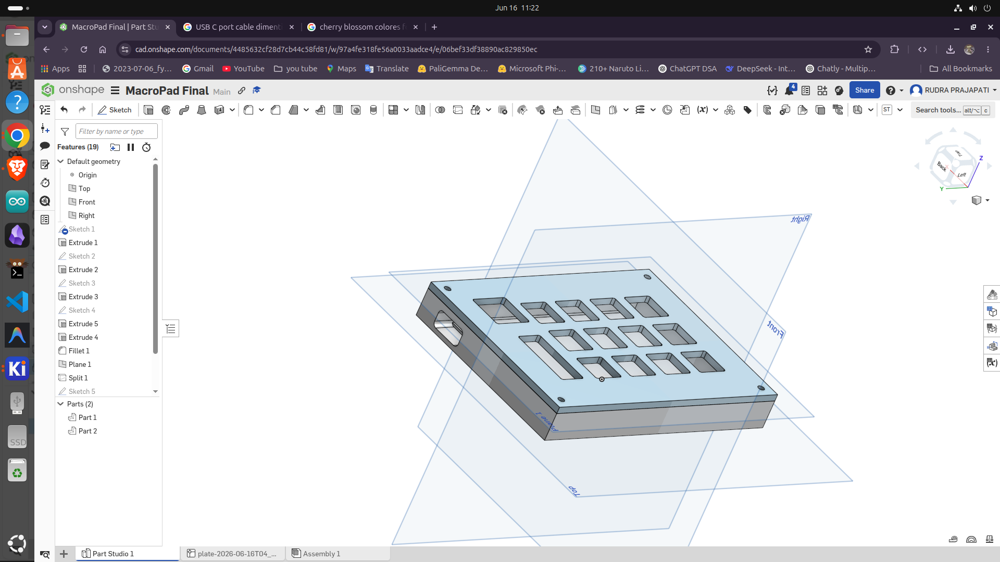
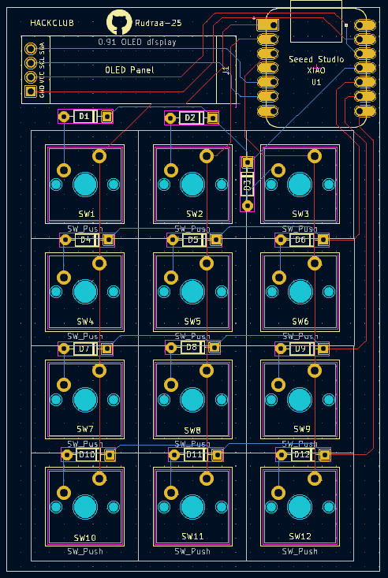
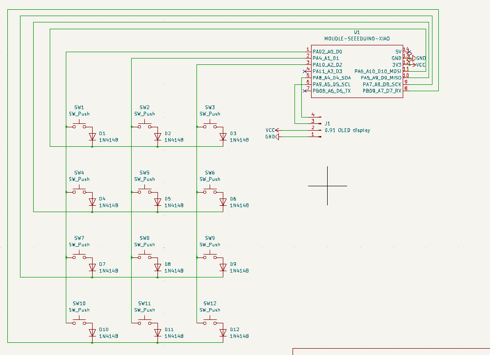

# cherryblossom pad

this is my custom 12 key macropad project for the hack club hackpad. it use a seeed xiao rp2040 and got 12 switch and a small oled display. i design the case in cad and the pcb in kicad. also when [...]

here is some photos of my desgin:

**my 3d cad model:**

**my pcb layout:**

**the schematic:**

### parts u need to build this
* 1x seeed studio xiao rp2040
* 1x 0.91 oled display
* 12x mx switches 
* 12x 1n4148 diodes
* my custom pcb (in the production folder)
* my 3d printed case (also in production folder)

check out `BOOM.csv` for the full bill of materials with pricing!

### firmwere setup
i am using KMK firmwere so its super simple. u dont need to compile any uf2 file yourself.
1. download the official circuitpython uf2 for the xiao rp2040 and drag it to the board.
2. download KMK firmwere and copy the `kmk` folder to the board
3. copy my `main.py` from the firmware folder to the board.
thats it it should work now!

### credits
- made with help of github copilot to generate the BOOM.csv bill of materials
